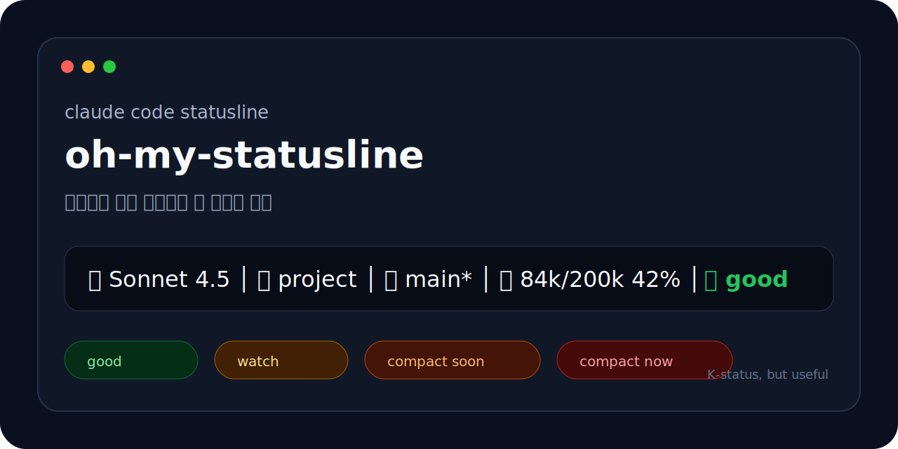

# oh-my-statusline



Claude Code statusline을 조금 더 예쁘고, 조금 더 실용적이고, 아주 약간 K-병맛스럽게 바꿔주는 작은 CLI입니다.

컨텍스트가 아직 멀쩡하면 조용히 `good`, 슬슬 위험하면 `watch`, 이제 정리해야 하면 `compact soon`, 진짜로 위험하면 `compact now`를 띄웁니다. 대충 “아직 괜찮음 / 슬슬 봐라 / 빨리 접어라 / 지금 접어라” 입니다.

기본 심볼 모드:

⌘ Sonnet 4.5 │ ⌥ oh-my-statusline │ ⏎ main* │ Ctx 84k/200k 42% │ good

이모지 모드:

🧠 Sonnet 4.5 │ 💼 oh-my-statusline │ 🌱 main* │ 🪟 84k/200k 42% │ ✅ good

## 왜 만들었나요

Claude Code 기본 statusline도 좋지만, 매일 보는 줄이면 조금 더 취향이 있어도 됩니다.

이 프로젝트는 아래 기준으로 만들었습니다.

- Nerd Font 없이도 최대한 덜 깨지게
- 컨텍스트 윈도우 크기와 compact 시점을 한눈에 보이게
- 비용/시간보다 실제 행동이 필요한 `context` 중심으로
- 업무 중에도 부담 없는 정도의 K-병맛 감성
- 설치는 `npx` 한 줄로 끝나게

## 설치

npm 배포 후에는 아래 한 줄이면 됩니다.

```sh
npx --yes oh-my-statusline-install
```

이모지 버전으로 설치하려면:

```sh
npx --yes oh-my-statusline-install --icons emoji
```

GitHub 저장소가 공개된 뒤에는 이렇게도 설치할 수 있습니다.

```sh
curl -fsSL https://raw.githubusercontent.com/simhani1/oh-my-statusline/main/install.sh | sh
```

로컬 체크아웃을 Claude Code에 바로 연결하려면:

```sh
git clone https://github.com/simhani1/oh-my-statusline.git
cd oh-my-statusline
npm test
node bin/install.js --local --icons emoji
```

설치 스크립트는 `~/.claude/settings.json`을 수정하기 전에 timestamp가 붙은 백업 파일을 먼저 만듭니다.

## 수동 설정

`~/.claude/settings.json`에 직접 넣어도 됩니다.

```json
{
  "statusLine": {
    "type": "command",
    "command": "npx --yes oh-my-statusline --icons emoji",
    "padding": 0
  }
}
```

심볼 모드가 좋다면:

```json
{
  "statusLine": {
    "type": "command",
    "command": "npx --yes oh-my-statusline",
    "padding": 0
  }
}
```

## 아이콘 모드

`symbols`는 기본값입니다. macOS 키보드 심볼 느낌이라 차분합니다.

⌘ Sonnet 4.5 │ ⌥ project │ ⏎ main* │ Ctx 84k/200k 42% │ good

`emoji`는 macOS 기본 이모지를 씁니다. 조금 더 눈에 들어오고, Nerd Font가 없어도 덜 억울합니다.

🧠 Sonnet 4.5 │ 💼 project │ 🌱 main* │ 🪟 84k/200k 42% │ ✅ good

직접 실행할 때:

```sh
oh-my-statusline --icons emoji
```

## 컨텍스트 상태 기준

마지막 라벨은 컨텍스트 사용률에 따라 색이 바뀝니다.

- `good`: 0-59%, 초록색. 아직 사람 구실 가능.
- `watch`: 60-74%, 노란색. 슬슬 눈치 보기.
- `compact soon`: 75-79%, 주황색. 정리할 타이밍.
- `compact now`: 80% 이상, 빨간색. 더 미루면 대화가 비대해집니다.

예시:

⌘ Sonnet 4.5 │ ⌥ project │ ⏎ main* │ Ctx 84k/200k 42% │ good

⌘ Sonnet 4.5 │ ⌥ project │ ⏎ main* │ Ctx 124k/200k 62% │ watch

⌘ Sonnet 4.5 │ ⌥ project │ ⏎ main* │ Ctx 152k/200k 76% │ compact soon

⌘ Sonnet 4.5 │ ⌥ project │ ⏎ main* │ Ctx 164k/200k 82% │ compact now

## 표시 형식

```text
{model} │ {project} │ {branch}{dirty} │ {used}/{total} {percent}% │ {status}
```

실제로는 아이콘 모드에 따라 앞쪽 표시만 바뀝니다.

```text
⌘ {model} │ ⌥ {project} │ ⏎ {branch}{dirty} │ Ctx {used}/{total} {percent}% │ {status}
```

```text
🧠 {model} │ 💼 {project} │ 🌱 {branch}{dirty} │ 🪟 {used}/{total} {percent}% │ {status}
```

`main*`의 `*`는 Git 변경사항이 있다는 뜻입니다.

## CLI

```sh
oh-my-statusline --help
oh-my-statusline --version
oh-my-statusline --icons emoji < input.json
oh-my-statusline --no-color < input.json
```

Claude Code가 statusline JSON을 stdin으로 넘기면, 이 CLI가 한 줄짜리 statusline을 stdout으로 출력합니다.

## 개발

```sh
npm test
node bin/install.js --local --icons emoji
```

## 배포

```sh
npm login
npm test
npm pack --dry-run
npm publish
```

GitHub 저장소 생성 후 push:

```sh
git init
git add .
git commit -m "feat: initial statusline"
git branch -M main
git remote add origin git@github.com:simhani1/oh-my-statusline.git
git push -u origin main
```

## 참고

Claude Code statusline은 `statusLine` 설정에 command를 연결하는 방식입니다. 이 패키지는 `~/.claude/settings.json`을 안전하게 갱신하고, 기존 설정 백업을 먼저 남깁니다.

## 라이선스

MIT
